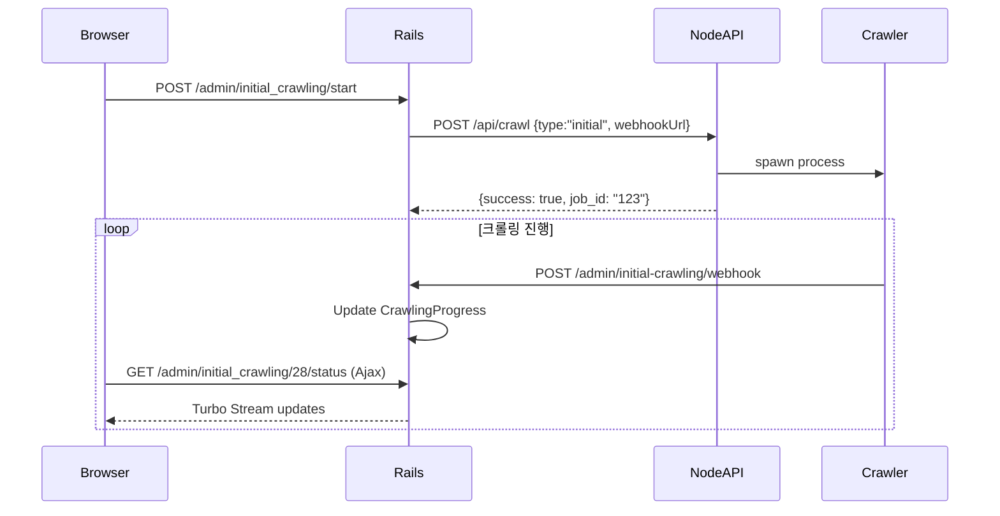

# Lab Dash Turbo - Rails 8 + Turbo Streams + ViewComponent + Ajax Polling

## 🎯 프로젝트 개요

Lab Dash Turbo는 lab-shop-crawler Node.js 서버와 통신하여 daulab.co.kr 사이트의 제품 정보를 크롤링하고 모니터링하는 Rails 8 기반 웹 애플리케이션입니다. ViewComponent와 Turbo Streams, Ajax Polling을 조합하여 Redis 없이도 실시간 업데이트를 구현했습니다.

## 🏗️ 아키텍처 철학

### Rails 8 철학
- **HTML-over-the-wire**: JSON API 대신 HTML 응답으로 서버 주도 상태 관리
- **No Build**: Webpack/ESBuild 없이 Import Maps 사용
- **Stimulus First**: 최소한의 JavaScript로 인터랙션 처리
- **서버 중심**: 클라이언트는 단순히 이벤트 전송, 서버가 UI 변경 결정

### 왜 ViewComponent를 사용하는가?
1. **CSS 격리**: 컴포넌트 내부에서 스타일 관리로 CSS 충돌 방지
2. **재사용성**: 동일한 UI 요소를 여러 곳에서 일관되게 사용
3. **테스트 용이성**: 독립적인 단위 테스트 가능
4. **유지보수성**: 컴포넌트별로 코드 분리되어 있어 찾기 쉽고 수정하기 편함

### 왜 Turbo Streams + Ajax Polling 조합인가?
1. **Redis 불필요**: ActionCable의 pub/sub 대신 async adapter 사용
2. **단순함**: WebSocket 연결 관리 복잡성 없음
3. **신뢰성**: HTTP 기반으로 프록시/방화벽 문제 없음
4. **실시간성**: 브로드캐스트로 즉시 UI 업데이트

## 🛠 기술 스택

### Core Framework
- **Rails 8.0.2** - 최신 웹 프레임워크
- **Ruby 3.3.0** - 프로그래밍 언어
- **SQLite 3** - 개발 데이터베이스
- **Propshaft** - 모던 에셋 파이프라인
- **ViewComponent 3.23.2** - 컴포넌트 기반 UI 아키텍처

### Frontend Stack
- **Turbo Streams** - 실시간 업데이트 (Redis 없이)
- **Stimulus 3.2.2** - JavaScript 프레임워크
- **Tailwind CSS 3.4.3** - 유틸리티 기반 CSS 프레임워크
- **Import Maps 2.0.1** - JavaScript 모듈 관리
- **Lucide Rails** - 모던 SVG 아이콘 라이브러리

### Infrastructure
- **Puma 6.4.0** - 고성능 웹 서버 (포트 7500)
- **Ajax Polling** - Node.js 서버 상태 확인
- **Webhook** - Node.js → Rails 진행상황 전달

## 📁 프로젝트 구조

```
lab-dash-turbo/
├── app/
│   ├── assets/
│   │   ├── builds/
│   │   │   └── tailwind.css        # 컴파일된 Tailwind CSS
│   │   └── stylesheets/
│   │       ├── application.css
│   │       └── theme.css
│   ├── components/                  # ViewComponents
│   │   ├── application_component.rb
│   │   └── crawling/
│   │       ├── status_card_component.rb
│   │       ├── progress_component.rb
│   │       ├── control_button_component.rb
│   │       └── step_indicator_component.rb
│   ├── controllers/
│   │   ├── admin/
│   │   │   └── initial_crawling_controller.rb  # 메인 컨트롤러
│   │   └── concerns/
│   ├── javascript/
│   │   ├── application.js
│   │   └── controllers/
│   │       ├── crawling_monitor_controller.js  # Turbo 상태 모니터링
│   │       └── crawling_status_controller.js   # Ajax Polling
│   ├── jobs/
│   │   └── crawling_polling_job.rb  # 백그라운드 폴링 (현재 미사용)
│   ├── models/
│   │   ├── concerns/
│   │   │   └── crawler_constants.rb  # 상수 정의
│   │   ├── crawling_session.rb       # 크롤링 세션
│   │   └── crawling_progress.rb      # 단계별 진행률
│   ├── services/
│   │   └── crawler_service.rb        # Node.js API 통신
│   └── views/
│       └── admin/
│           └── initial_crawling/
│               ├── index.html.erb
│               ├── _status_cards.html.erb
│               ├── _control_panel.html.erb
│               ├── _progress_section.html.erb
│               └── _step_indicator.html.erb
├── config/
│   ├── routes.rb                     # admin namespace 라우팅
│   ├── cable.yml                     # adapter: async (Redis 없음)
│   └── puma.rb                       # port: 7500
└── CLAUDE.md
```

## 🔄 아키텍처

### 통신 구조
```
[Browser] <--Turbo Streams--> [Rails] <--HTTP Polling/Webhook--> [Node.js]
     ↓                           ↓                                    ↓
[Stimulus]                  [SQLite DB]                         [Crawler DB]
```

### 실시간 업데이트 (Redis 없이)
- **Turbo Streams**: `adapter: async` 사용 (메모리 기반)
- **Ajax Polling**: 5초 간격으로 Node.js 상태 확인
- **ViewComponent**: UI 컴포넌트 캡슐화

## 🚀 주요 기능

### 1. 초기 크롤링
- **경로**: `/admin/initial_crawling` (단수형)
- **특징**: 
  - 4단계 자동화 프로세스
  - ViewComponent 기반 UI
  - Turbo Streams 실시간 업데이트
  - Ajax Polling으로 진행상황 추적

### 2. 대시보드 (추후 구현)
- 일일 크롤링 결과
- 가격 변동 모니터링
- 재고 현황

## 💎 ViewComponent 구조

### 기본 컴포넌트
```ruby
# app/components/application_component.rb
class ApplicationComponent < ViewComponent::Base
  include ApplicationHelper
  
  def safe_classes(*classes)
    classes.compact.join(' ')
  end
end
```

### 크롤링 컴포넌트
- `StatusCardComponent`: 상태 카드
- `ProgressComponent`: 진행률 표시
- `ControlButtonComponent`: 제어 버튼
- `StepIndicatorComponent`: 단계 표시기

## 🎨 ViewComponent 아키텍처

### 장점
1. **CSS 안정성**: 컴포넌트별로 CSS가 캡슐화되어 변경 시 다른 부분에 영향 없음
2. **재사용성**: 동일한 컴포넌트를 여러 곳에서 사용 가능
3. **테스트 용이성**: 각 컴포넌트를 독립적으로 테스트 가능
4. **유지보수성**: 컴포넌트 단위로 코드가 구성되어 있어 찾기 쉽고 수정하기 편함

### 컴포넌트 구조
```ruby
class Crawling::StatusCardComponent < ApplicationComponent
  def initialize(title:, value:, icon:, status: :idle, dom_id: nil)
    @title = title
    @value = value
    @icon = icon
    @status = status
    @dom_id = dom_id
  end

  private

  def status_color_class
    case @status
    when :running then "text-blue-600"
    when :completed then "text-green-600"
    when :error then "text-red-600"
    else "text-gray-600"
    end
  end
end
```

### Tailwind CSS 통합
- **정적 클래스만 사용**: Tailwind의 purge 시스템 때문에 동적 클래스 생성 불가
- **컴포넌트 내부에서 관리**: 각 컴포넌트가 자체 스타일 로직 보유
- **safe_classes 헬퍼**: 안전한 클래스 조합을 위한 유틸리티

## 📡 API 통신

### Rails → Node.js (CrawlerService)
```ruby
# app/services/crawler_service.rb
class CrawlerService
  CRAWLER_API_URL = "http://localhost:3334"  # /api 제외
  
  # API 엔드포인트 (crawler_constants.rb에서 정의)
  API_ENDPOINTS = {
    health: '/api/health',
    status: '/api/status',
    crawl: '/api/crawl',
    pause: '/api/pause',
    resume: '/api/resume',
    stop: '/api/stop',
    reset: '/api/full-setup/reset',
    progress: '/api/progress'
  }
end
```

### Node.js → Rails (Webhook)
```
POST /admin/initial_crawling/webhook
{
  "type": "log|progress|status_change",
  "session_id": 123,
  "step": 1,
  "progress": 50,
  "message": "Processing category collection...",
  "level": "info|warning|error|success"
}
```

### Ajax Polling (Stimulus)
```javascript
// app/javascript/controllers/crawling_status_controller.js
// 3초마다 상태 확인
fetch(`/admin/initial_crawling/${sessionId}/status`, {
  headers: {
    'Accept': 'text/vnd.turbo-stream.html',
    'X-Requested-With': 'XMLHttpRequest'
  }
})
```

## 🛠 개발 환경 설정

### 1. 의존성 설치
```bash
bundle add view_component
bundle install
npm install
bin/rails generate component:install
```

### 2. 데이터베이스 설정
```bash
bin/rails db:create
bin/rails db:migrate
```

### 3. 서버 실행
```bash
# Rails (포트 7500)
bin/rails server

# 또는 Procfile.dev 사용
bin/dev

# Node.js 크롤러 (별도 터미널)
cd /Users/macstudio/node/lab-shop-crawler
npm run api:dev
```

## 🎨 Turbo Streams HTML 구조 규칙

### 필수 준수 사항
1. **ID는 교체할 최소 단위에만 부여**
   - 큰 wrapper에 ID를 주지 말고, 실제 변경되는 부분에만 ID 부여
   - 예: control-panel 전체가 아닌 status-section, control-buttons 각각에 ID

2. **data 속성 위치**
   - `data-crawling-status`같은 중요한 속성은 교체되는 요소에 포함
   - JavaScript가 읽어야 하는 속성은 Turbo가 교체하는 범위 내에 포함

3. **partial 분리 원칙**
   ```erb
   <!-- 나쁜 예: 하나의 큰 partial -->
   <div id="control-panel">
     <%= render 'control_panel' %>
   </div>
   
   <!-- 좋은 예: 세분화된 partial -->
   <section id="status-section">
     <%= render 'status_section' %>
   </section>
   <section id="control-buttons">
     <%= render 'control_buttons' %>
   </section>
   ```

4. **Semantic HTML 사용**
   - article, section, header, footer 등 의미있는 태그 사용
   - div 남용 금지

## 🎨 Tailwind CSS 사용 규칙

### ✅ 올바른 사용
```ruby
# 정적 클래스만 사용
def button_classes
  case variant
  when :primary then "bg-blue-600 hover:bg-blue-700"
  when :danger then "bg-red-600 hover:bg-red-700"
  end
end
```

### ❌ 잘못된 사용
```ruby
# 동적 클래스 생성 금지
"bg-#{color}-600"  # Tailwind가 인식 못함
```

## 🔧 개발 가이드

### ViewComponent 생성
```bash
bin/rails generate component Crawling::NewFeature title:string status:string
```

### Turbo Streams 브로드캐스트
```ruby
Turbo::StreamsChannel.broadcast_replace_to(
  "crawling_session_#{session.id}",
  target: "status-cards",
  partial: "admin/initial_crawling/status_cards",
  locals: { status: status }
)
```

### Stimulus 컨트롤러
```javascript
// app/javascript/controllers/crawling_monitor_controller.js
// Ajax Polling 및 명령 전송 처리
```

## 🐛 트러블슈팅

### CSS 클래스가 적용되지 않을 때
1. Tailwind 빌드 확인: `bin/rails tailwindcss:build`
2. 정적 클래스만 사용하는지 확인
3. ViewComponent 내부 클래스 확인

### Turbo Streams 업데이트 안될 때
1. **HTML 구조 확인**
   - ID가 교체할 최소 단위에 있는지 확인
   - data 속성이 교체되는 요소 내부에 있는지 확인
   - partial이 세분화되어 있는지 확인

2. **Turbo 이벤트 디버깅**
   ```javascript
   // application.js에 추가
   document.addEventListener('turbo:before-stream-render', (event) => {
     console.log('Turbo Stream rendering:', event.detail.newStream);
   });
   ```

3. **대체 방법들**
   - **즉시 해결**: `window.location.reload()`
   - **부분 해결**: 특정 섹션만 fetch로 다시 로드
   - **Turbo 이벤트 활용**: `turbo:after-stream-render` 리스닝

4. **Rails 8 권장 패턴**
   ```ruby
   # 세분화된 업데이트
   render turbo_stream: [
     turbo_stream.replace("status-section", partial: "status_section"),
     turbo_stream.replace("control-buttons", partial: "control_buttons")
   ]
   ```

5. **흔한 실수들**
   - ❌ 큰 wrapper에 ID 부여 → ✅ 실제 변경 부분에만 ID
   - ❌ ViewComponent의 HTML 주석이 Turbo 방해 → ✅ production에서는 주석 제거
   - ❌ data 속성이 교체 범위 밖에 → ✅ 교체되는 요소에 포함

### Polling 멈출 때
1. 브라우저 콘솔 에러 확인
2. Node.js API 서버 상태 확인
3. CSRF 토큰 확인

## 📅 업데이트 이력

상세한 업데이트 이력은 `업데이트.md` 파일을 참조하세요.

### 2025-07-27 (새벽)
- **RemixIcon 완전 제거 및 버튼 기능 수정**
  - _control_panel.html.erb의 모든 RemixIcon 제거
  - _status_cards.html.erb의 RemixIcon 제거
  - StatusCardComponent를 lucide_icon 사용하도록 수정
  - sync_crawling 페이지의 RemixIcon 제거 및 ERB 문법 오류 수정
    - onclick 속성의 중첩 ERB 태그를 `data-disable-with`로 변경
  - _alert.html.erb의 아이콘 수정 (alert_icon 헬퍼 활용)

### 2025-07-26 (오후)
- **Lucide Rails 아이콘 라이브러리 도입**
  - RemixIcon CDN에서 lucide-rails gem으로 전환
  - 모든 아이콘을 Lucide SVG로 교체
  - `lucide_icon` 헬퍼 메서드로 일관된 스타일 적용
  - 아이콘 크기 통일 (w-5 h-5, w-4 h-4, w-6 h-6 등)
  - 주요 아이콘 변경:
    - 크롤링 제어: `ri-settings-3-line` → `terminal`
    - 크롤링 시작: `ri-download-cloud-line` → `cloud-download`
    - 초기화: `ri-refresh-line` → `rotate-cw`
    - 재생/정지: `ri-play-line/ri-stop-line` → `play/square` (Lucide에는 stop 아이콘이 없어 square 사용)
    - 일시정지: `ri-pause-line` → `pause`
    - 경고: `ri-alert-line/ri-error-warning-line` → `alert-triangle`
    - 정보: `ri-information-line` → `info`
    - 크롤러 상태: `ri-robot-line` → `bot`
    - 현재 단계: `ri-loader-4-line` → `loader-2`
    - 진행률: `ri-percent-line` → `percent`
    - 시간: `ri-time-line` → `clock`
- **아이콘 헬퍼 시스템 구축**
  - `IconHelper` 모듈 생성으로 중앙 관리
  - `app_icon` 메서드로 일관된 아이콘 사용
  - 아이콘 매핑 테이블로 쉬운 변경 가능
- **컴포넌트 수정**
  - `StatusCardComponent`: `<i>` 태그에서 `lucide_icon` 헬퍼로 변경
  - `ControlButtonComponent`: lucide_icon 사용 확인
  - 모든 ViewComponent에서 Lucide 아이콘 사용
- **UI 개선**
  - 단계 표시기 카드 디자인 통일 (크롤링 제어 카드와 동일한 스타일)
  - 수직 여백 축소로 스크롤바 제거 (p-6 → p-4, mb-6 → mb-4)

### 2025-07-26
- ViewComponent + Turbo Streams + Ajax Polling 완전 구현
- Admin 네임스페이스로 컨트롤러 구조 개편
- Stimulus 컨트롤러로 실시간 상태 모니터링
- Tailwind CSS 동적 클래스 문제 해결 (정적 클래스만 사용)
- CrawlingSession에 crawling_type 컬럼 추가
- 포트 7500으로 고정
- Node.js API 통합 테스트 완료
- Routes 구조 변경: 단수형 컨트롤러에 맞게 명시적 라우팅 설정
  - `/admin/initial_crawling` (단수형) 경로 사용
  - 경로 헬퍼: `admin_initial_crawling_index_path`, `admin_start_initial_crawling_path` 등
  - 복수형 경로 `/admin/initial_crawlings`를 단수형으로 리다이렉트 추가
- Playwright MCP 테스트 필수화 - 모든 기능 추가/수정 시 자동 테스트 검증
- alert_classes 헬퍼 메서드 ApplicationHelper에 추가
- Turbo Stream 응답 처리 개선: Accept 헤더 명시적 확인
- Node.js reset 엔드포인트 개선: 백업 후 step1~4만 삭제, backup/products 폴더 보호
- Turbo Frames 추가: control-panel을 turbo_frame_tag로 감싸 즉시 업데이트 개선
- 컨트롤러 액션에서 무조건 Turbo Stream 응답하도록 수정
- 폴링 간격 1초로 단축 (3초 → 1초)
- Webhook 수신 시 즉시 Turbo Stream broadcast 구현
  - `broadcast_all_updates` 메서드로 모든 UI 요소 즉시 업데이트
  - `turbo_stream_from` 태그로 WebSocket 구독
  - Node.js에서 sessionId 전달 및 webhook에 포함
- 단계 표시기 활성화 개선: 현재 진행 중인 단계 반영
- 진행률 섹션 삭제: 크롤러 상태만 제어 패널에 통합
  - progress_section 제거
  - control_panel에 크롤러 상태 표시 추가
  - 모든 Turbo Stream 업데이트에서 progress-section 제거
- 중지 버튼 클릭 시 즉시 UI 업데이트
  - stop, pause, resume 액션에서 전체 UI 업데이트
  - 중지 시 CrawlingProgress 삭제로 단계 초기화
  - control-panel의 turbo_frame_tag를 div로 변경 (CSS 깨짐 방지)
- **button_to → Stimulus + fetch 전환 완료**
  - 페이지 리프레시 없이 Turbo Stream 구독 유지
  - ControlButtonComponent에서 data-action 속성 생성
  - crawling_monitor_controller.js에 모든 액션 메서드 구현
  - CustomEvent로 세션 정보 전달 방식 구현

### 2025-07-25
- ViewComponent 기반 구조로 전면 개편
- Turbo Streams + Ajax Polling 조합 구현
- Redis 의존성 제거 (async adapter 사용)
- 안정적인 CSS 관리를 위한 컴포넌트 캡슐화

## 📝 작업 시 주의사항

### ⚠️ 필수 작업 순서
**모든 코드 작업(오류 수정, 새 기능 추가, 업데이트, 삭제 등) 전에 반드시:**
1. **CLAUDE.md 파일을 먼저 읽고 확인**
2. **프로젝트 구조와 기술 스택 파악**
3. **기존 파일 구조와 상수값 확인**
4. **작업 완료 후 CLAUDE.md 업데이트 필수**
5. **Playwright MCP로 테스트 검증 필수** (기능 추가/수정 시)

### 코드 작업 원칙
- **새 파일 생성 금지**: 기존 파일 업데이트만 수행
- **상수값 확인**: `crawler_constants.rb`와 Node.js 상수 매칭 확인
- **경로 확인**: 라우트 구조와 경로 헬퍼 사용 확인
- **컴포넌트 재사용**: ViewComponent 구조 활용
- **button_to 사용 금지**: 페이지 리프레시로 Turbo Stream 구독이 끊어짐
  - 반드시 Stimulus + fetch로 구현
  - data-action 속성으로 컨트롤러 메서드 연결
- **이벤트 방식 변경 시 연계 파일 확인**:
  1. Component (HTML/Ruby) - 버튼 렌더링
  2. JavaScript Controller - 이벤트 처리
  3. Rails Controller - 요청 처리
  4. Service Object - API 통신
  5. View partials - UI 업데이트

### 테스트 검증 (필수)
**Playwright MCP를 사용한 테스트 항목:**
- 페이지 접속 및 리다이렉트 확인
- UI 요소 정상 작동 확인
- 기능 추가/수정 사항 동작 검증
- 스크린샷 캡처로 시각적 확인
- 에러 발생 여부 체크

### 업데이트 기록
모든 중요한 변경사항과 문제 해결 과정은 다음과 같이 기록:
1. **CLAUDE.md 파일 업데이트** (필수)
   - 변경된 구조나 기능 반영
   - 업데이트 이력에 날짜와 내용 추가
2. **업데이트.md 파일 기록** (상세 내용)
   - 날짜와 시간
   - 요청 내용
   - 문제 상황
   - 해결 방법
   - 테스트 결과

이렇게 하면 향후 유사한 문제 발생 시 빠르게 참고할 수 있습니다.

## 🤖 AI 프롬프트 가이드

### 기본 원칙
AI에게 요청할 때는 다음 정보를 명확히 제공하세요:
1. **현재 상황**: 어떤 문제가 발생했는지
2. **시도한 방법**: 이미 시도해본 해결책
3. **기대 결과**: 원하는 동작이 무엇인지
4. **제약 조건**: Rails 8 규칙, ViewComponent 사용 등

### 상황별 프롬프트 예시

#### 1. UI가 실시간으로 업데이트되지 않을 때
```
문제: 중지 버튼을 클릭했는데 UI가 즉시 바뀌지 않고 새로고침해야만 반영됩니다.
환경: Rails 8, Turbo Streams, ViewComponent
제약: button_to 사용 금지, Stimulus + fetch만 사용
시도: Turbo Stream response는 정상적으로 받고 있음
원인 파악과 해결책을 알려주세요.
```

#### 2. CSS 수정 시 기능이 깨질 때
```
문제: Tailwind CSS 클래스를 수정했더니 JavaScript 기능이 작동하지 않습니다.
파일: app/components/crawling/control_button_component.rb
변경 내용: bg-blue-500을 bg-primary-500로 변경
ViewComponent 구조를 유지하면서 해결하는 방법을 알려주세요.
```

#### 3. 새로운 기능 추가 시
```
요청: 크롤링 진행 상황을 차트로 시각화하고 싶습니다.
기술 스택: Rails 8, ViewComponent, Turbo Streams
제약: 
- CDN 사용 금지 (Import Maps 사용)
- 실시간 업데이트 필요
- ViewComponent로 캡슐화
구현 방법과 필요한 gem을 알려주세요.
```

#### 4. Node.js 연동 문제
```
문제: Node.js 크롤러 서버와 통신이 안 됩니다.
Node.js: localhost:3334
Rails webhook: /admin/initial_crawling/webhook
증상: 크롤링은 시작되는데 진행상황이 업데이트되지 않음
CrawlerService와 webhook 설정을 확인해주세요.
```

### 필수 컨텍스트 제공
```
프로젝트: Lab Dash Turbo
Rails 버전: 8.0.2
아키텍처: ViewComponent + Turbo Streams + Ajax Polling
규칙:
- Client → Server: Stimulus + fetch (button_to 금지)
- Server → Client: Turbo Streams only
- No inline JavaScript
- Tailwind static classes only
```

### 피해야 할 요청
❌ "이 기능 만들어줘"
❌ "안 돼"
❌ "에러 남"

### 좋은 요청 예시
✅ "ViewComponent 구조를 유지하면서 버튼 색상을 동적으로 변경하려면?"
✅ "Turbo Stream이 DOM을 업데이트하지 않는데, HTML 구조를 어떻게 수정해야 할까?"
✅ "Rails 8 규칙을 지키면서 파일 업로드 기능을 구현하는 방법은?"

## 🔗 Node.js Crawler Server와의 연동

### 1. Node.js 서버 구조 (lab-shop-crawler)
```
lab-shop-crawler/
├── api-server.js                    # Express API 서버 (포트 3334)
│   └─ Rails 연결: CrawlerService가 이 서버와 통신
│
├── scripts/
│   ├── initial-setup/               # 초기 크롤링 스크립트
│   │   ├── full-initial-setup.js    # Rails: POST /api/crawl {type: "initial"}
│   │   ├── step1_source.js          # 카테고리/제품 크롤링
│   │   ├── step2_ai_parents_detail.js  # AI 데이터 처리
│   │   ├── step3_generate_catalog_numbers.js  # 카탈로그 번호
│   │   └── step4_setup_database.js  # DB 구축
│   │
│   └── daily/                       # 일일 크롤링
│       └── daily-crawler-db.js      # Rails: POST /api/crawl {type: "daily"}
│
├── utils/
│   ├── webhook-reporter.js          # Rails webhook 전송
│   │   └─ POST /admin/initial-crawling/webhook
│   └── crawler-controller.js        # 프로세스 제어
│
└── data/
    └── lab-shop.db                  # SQLite 데이터베이스
```

### 2. Rails ↔ Node.js 통신 흐름


### 3. 중요 상수값 매칭

#### Rails (crawler_constants.rb)
```ruby
CRAWLING_STEPS = {
  1 => '카테고리 및 제품 수집',
  2 => 'AI 데이터 처리',
  3 => '카탈로그 번호 생성',
  4 => '데이터베이스 저장'
}

API_ENDPOINTS = {
  crawl: '/api/crawl',
  status: '/api/status',
  pause: '/api/pause',
  resume: '/api/resume',
  stop: '/api/stop'
}
```

#### Node.js (api-server.js)
```javascript
// 크롤링 타입
type: 'initial' | 'daily'

// 프로세스 상태
crawlerStatus = {
  isRunning: boolean,
  isPaused: boolean,
  status: 'idle|running|paused|completed|failed'
}
```

### 4. 파일 연동 관계

| Rails 파일 | 역할 | Node.js 연결점 |
|------------|------|----------------|
| `admin/initial_crawling_controller.rb` | 메인 컨트롤러 | `/api/*` 엔드포인트 호출 |
| `crawler_service.rb` | API 통신 서비스 | `http://localhost:3334` |
| `crawling_status_controller.js` | Ajax 폴링 | 상태 확인 주기 실행 |
| `crawling_monitor_controller.js` | Turbo 업데이트 | Webhook 응답 처리 |
| `crawler_constants.rb` | 상수 정의 | API 엔드포인트, 상태값 |

### 5. Webhook 데이터 흐름
```
Node.js (webhook-reporter.js) 
  ↓
POST /admin/initial-crawling/webhook
  ↓
Rails (initial_crawling_controller#webhook)
  ↓
CrawlingProgress 업데이트
  ↓
Turbo Stream broadcast
  ↓
Browser UI 업데이트
```

## 🔮 향후 계획

### 단기
- [ ] 일일 크롤링 자동화 (Cron)
- [ ] 크롤링 결과 리포트
- [ ] 에러 핸들링 강화

### 장기
- [ ] 쇼핑몰 통합
- [ ] 가격 변동 알림
- [ ] 재고 관리 시스템